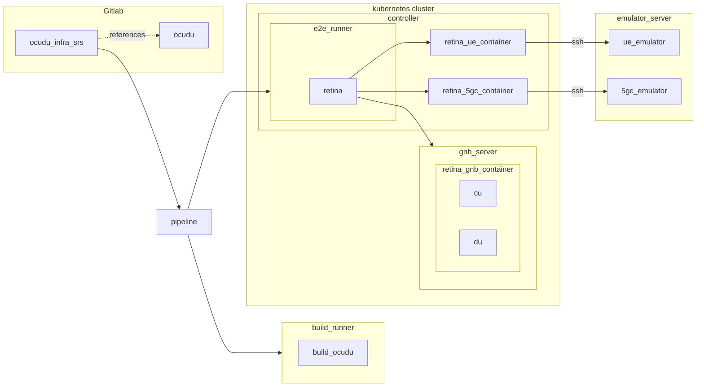

# OCUDU Infra SRS

This repository contains all the software required to run the [SRS](https://srs.io/) suite of end-to-end tests for [OCUDU](https://gitlab.com/ocudu):

- E2E test code and configurations.
- E2E framework.
- Pipeline as Code (Gitlab CI/CD).
- Infrastructure as Code templates.
- Auxiliary scripts.

A third-party entity can replicate this repo's CI/CD to create their own e2e suite of tests, reusing the test automation framework. To facilitate that task, Infrastructure as Code templates and examples are available.

This repository has dependencies on third-party hardware and software, such as O-RUs, SDRs, commercial off-the-shelf (COTS) UEs, 5GC, and UE emulators.

## Overview

`ocudu_infra_srs` repo defines Gitlab CI/CD pipelines that trigger the suite of e2e tests. A pipeline looks like the example below:

- When a pipeline is triggered, the first stage consists of building OCUDU according to the needs of the E2E tests. A job downloads OCUDU code and generates the binaries. The job can run in any runner with a compatible tag (GitLab shared runners, cloud, on-prem, etc.)
- E2E jobs run [Retina, our testing framework](retina/README.md) to set up and run that test.
  - The job needs to run either inside a Kubernetes cluster or from outside with network access to the cluster.
  - Before running the test, Retina orchestrates containers for each component of the test.
  - During the test, Retina executes code in every container to manage binaries and hardware.

## Index

- [Infrastructure Setup](infrastructure/README.md)
- [Gitlab CI Components](templates/README.md)
- [OCUDU E2E Testing](e2e/README.md)
- [Retina Framework for E2E Testing](retina/README.md)
- [About the documentation](/docs/README.md) in [https://ocudu.gitlab.io/ocudu_infra_srs](https://ocudu.gitlab.io/ocudu_infra_srs).
