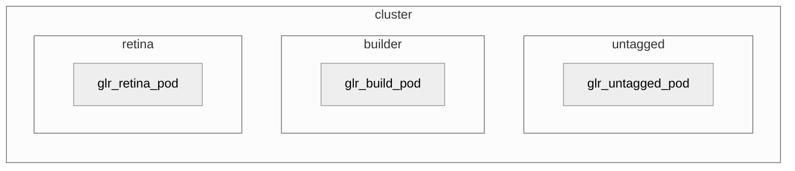
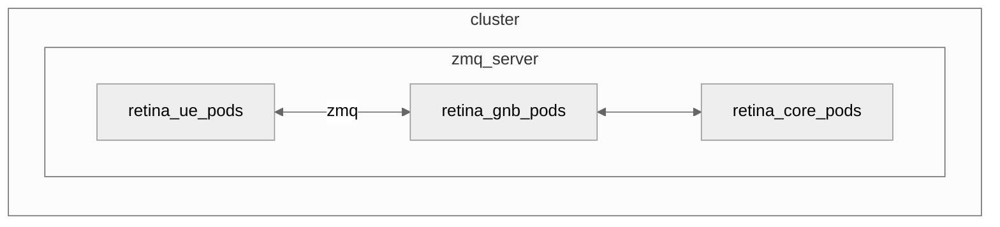
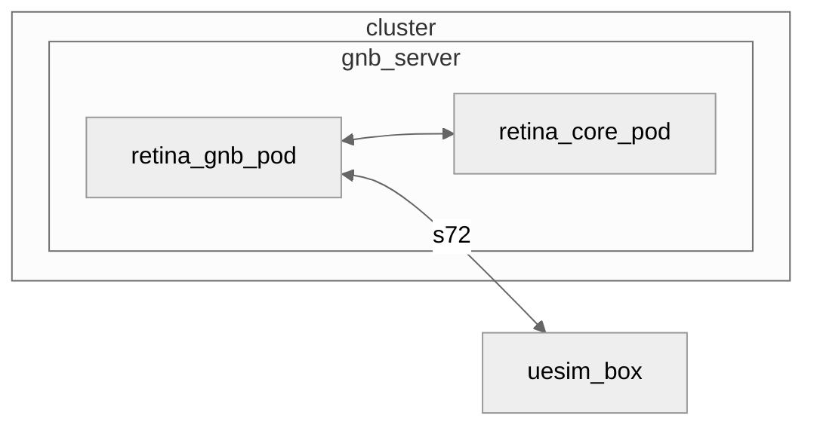
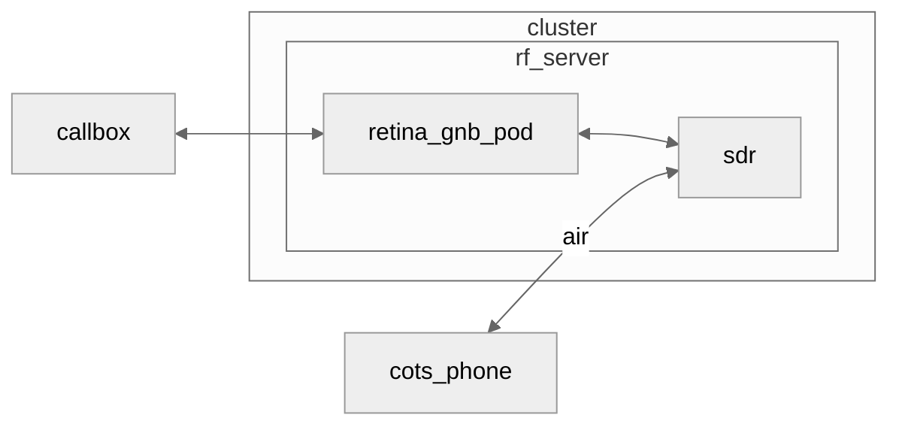

# IaC Full Example

This folder contains a full example of a cluster defined in IaC. It covers the following testbeds:

## Gitlab runners

- 1 PC/VM for building OCUDU
- 1 PC/VM for untagged jobs
- 1 PC/VM for running Retina Tests

## ZMQ Testbed

- 1 Server to run one or multiple ZMQ tests

## s72 Testbed

- 1 Server to run OCUDU
- 1 UE SimBox (outside of the cluster)

## RF Testbed

- 1 Server to run OCUDU, with a SDR
- 1 COTS Phone
- 1 Core (outside of the cluster)
