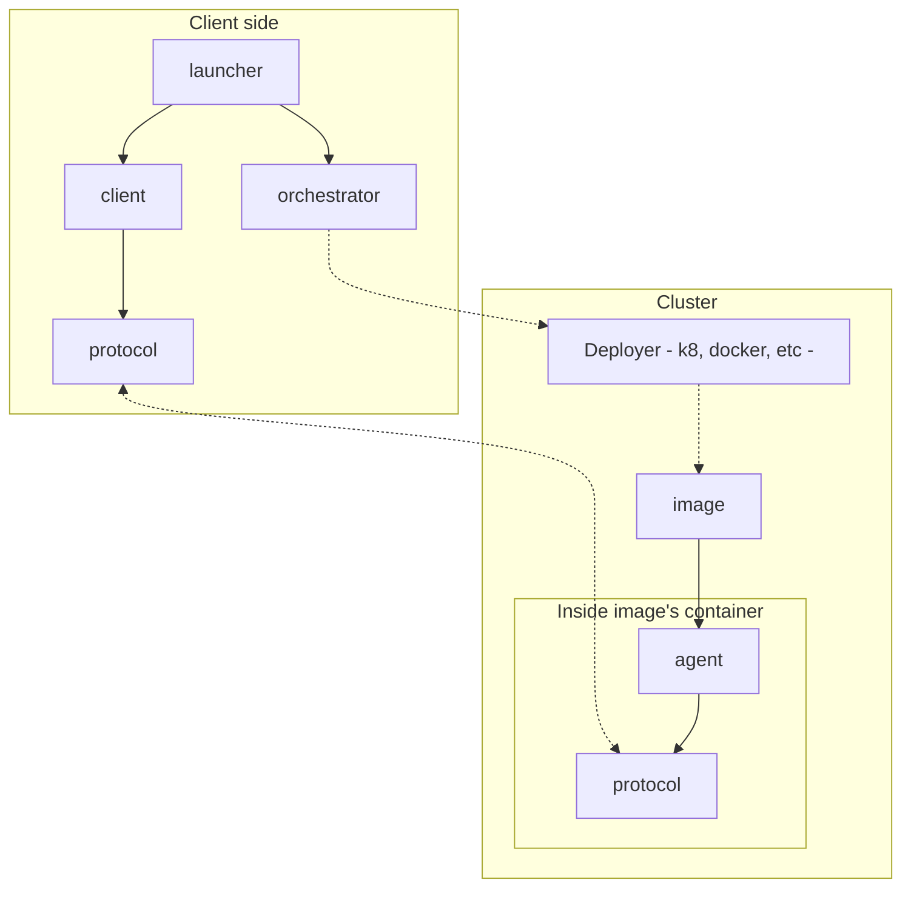
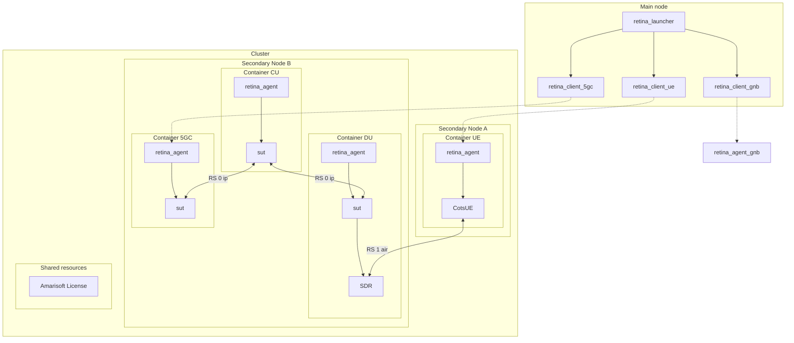
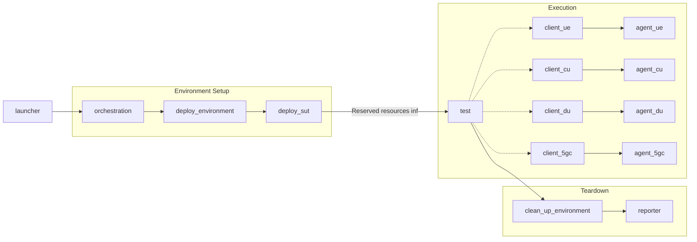
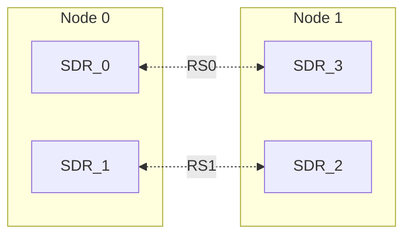

# Overview

## Architecture

Retina libraries and their relationships:

- **protocol**: for each item (ue, 5gc, ...) there's a set of actions this item can do in the framework. That is the protocol.
- **agent**: for each software under test there is a manager that implements the server side of the item protocol and handle how to call the binary.
- **client**: client side of the protocol for each item.
- **images**: The agent is deployed into the node using a container. Alongside the agent itself and the software-under-test, the container specifies the OS where the agent is going to run: libraries, binaries, tools, configuration and more.
- **Orchestrator**: Library in charge of resource booking and deploying the containers in the kubernetes cluster.
- **Launcher**: pytest wrapper with a set of fixtures that can be used in the tests to isolate the test from the other stages (orchestration, creating clients, reporting and more).

## How does Retina work?

This diagram is an example of a possible test infrastructure used in a retina execution.

And those are the steps Retina does internally to run the test:

1. When running a test, the launcher will read the infrastructure requested (in a file like retina_requests/zmq.yml) and it will pass that information to the orchestrator.
2. Looking at the cluster status (available nodes and resources) it will book required resources. In case the requested test infrastructure is not possible, it will fail.
3. After booking the resources, the orchestration stage will launch a deployment. It means that containers will be deployed and started in proper nodes.
4. In some cases, we want to copy information into the container / agent. For example, copying a gnb binary to run it, This is done in latest orchestration stage.
5. Launcher returns the control to the test execution, receiving a set of available agents.
6. Tets steps and assert are executed. The test will manage one client for each agent and clients will send commands to the agent running in the cluster, like start the software under test, stop it and more.
7. After the test finishes, orchestrator will clean up the deployments and unlock resources.
8. Final stage is the reporter, in charge of generating a report, images and more.

## Legend

| Name | Description | Examples |
| ---- | ----------- | -------- |
| Cluster | PC Network and available resources there | - Lab network (PCs, SDRs, etc) / AWS / Another company laboratory |
| Node | PCs that can run a test or a subset of the test (setup devices, run binaries, etc.) | PC that runs containers in Kubernetes. / PC that runs a sut. |
| SUT | Software under test | ocudu gnb / amarisoft ue… |
| NUT | Network under test | RAN network: 1 ue, 1 enb, 1 5gc  |
| Shared Resource | Resource shared by all the nodes in the cluster | Floating license |
| Node Resource | Resource available to one and only one PC/Node | COTS phone, SDR, SSD… |
| Wired Resource (Node resource sub-type) | A physical resource connected to one node. External (plugged) to the node. | COTS phone, SDR…
| Computing Resource (Node resource sub-type) | A physical resource available in the node | Accelerators like FPGA, GPU…  |
| Virtual Resource (Node resource sub-type) | A non-physical resource that belongs to one node | zmq, socket |
| RS - Resource space | Connection between 2 or more resources (wired or virtual) | SDR0 – SDR1 wire / ZMQ between multiple PCs |
| Main Node | PC running the test framework (main/client) | PC outside the cluster (but needs access to it), in the cluster or in the CI |
| Secondary Node | PC running the test framework agent in charge of a SUT or resource | PC in cluster (f.e. managed by kubernetes) |
| Virtual Secondary Node | When a system (embedded board / small PC) doesn’t have enough power to become a secondary node, A virtual node will be in charge of managing it. | ZCU111 board |

## Resource space

Connection between 2 or more node resources. A resource space must be fully reserved. **The minimum reserve unit for the node resources is the resource space**

In the following example SDR0 and SDR3 belong to the Resource Space 0. SDR1 and SDR2 belong to the Resource Space 1.
If you want to use SDR2 you need to reserve the Resource Space 1.

