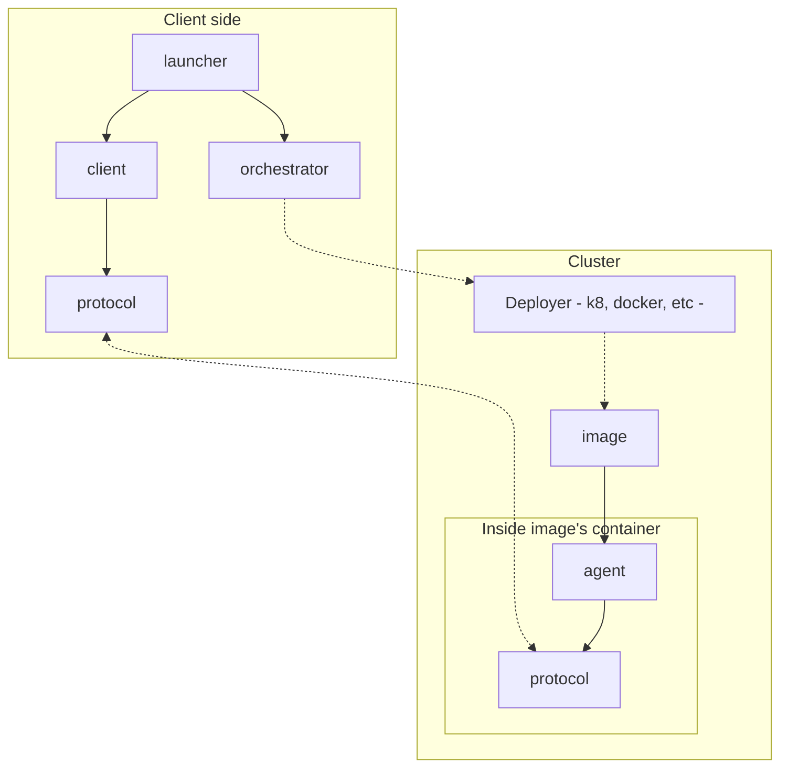

# Architecture

Retina libraries and their relationships:

- [protocol](../protocol/README.mdx): for each item (ue, 5gc, ...) there's a set of actions this item can do in the framework. That is the protocol.
- [agent](../agent/README.md): for each software under test there is a manager that implements the server side of the item protocol and handle how to call the binary.
- [client](../client/README.md): client side of the protocol for each item.
- [images](../images/README.md): The agent is deployed into the node using a container. Alongside the agent itself and the software-under-test, the container specifies the OS where the agent is going to run: libraries, binaries, tools, configuration and more.
- [Orchestrator](../orchestrator/README.md): Library in charge of resource booking and deploying the containers in the kubernetes cluster.
- [Launcher](../launcher/README.md): pytest wrapper with a set of fixtures that can be used in the tests to isolate the test from the other stages (orchestration, creating clients, reporting and more).
